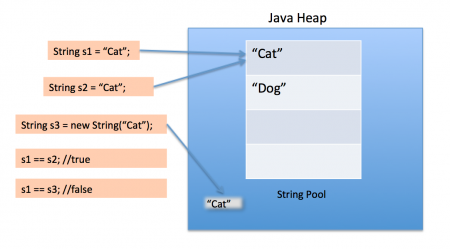

# String 클래스 기본 메서드

### 문자열(**String) 선언 방법**

자바의 문자열은 java.lang 패키지의 String클래스의 인스턴스로 관리되며, 문자열을 선언하는 방법에는 두 가지가 있다.

1) 생성자인 new 연산자로 새로운 객체를 생성할 수 있다.

```java
String str= new String("하이");
//String str = "하이"; 와 같음
```

2) " "안에 값을 입력하여 리터럴로 생성할 수 있다.

```java
String str = "하이"
```

- 두 방식의 차이점

    JVM이 관리하는 메모리 구조에서 차이점을 확인할 수 있다. **new 연산자**를 통해 문자열 객체를 생성하는 경우 메모리의 Heap 영역에 할당되고, **리터럴을 이용한 경우**에는 Heap 영역 내 `String Constant Pool` 영역에 할당된다.

    

     **리터럴("")을 이용할 경우**, 내부적으로 String 생성자로 객체를 heap 영역에 생성한 후 intern 메소드가 호출되어 상수 풀(String Constant Pool)에 해당 객체를 등록한다. intern 메소드는 실행 후 해당 문자열과 동일한 문자열이 없다면 해당 객체를 상수 풀에 등록하고 heap 영역에서 해제 후 래퍼런스 값을 반환하게 된다. 여기서 해당 문자열과 동일한 문자열이 있다면 해당 객체를 heap 영역에서 해제 후 상수 풀에 있는 해당 문자열의 래퍼런스 값을 반환해준다. 따라서 중복 문자열에 대한 효율적인 메모리 관리가 가능하다.<br/>
     **String 생성자를 이용하는 경우**는 heap의 어떤 영역에 단순한 인스턴스로 저장되며, 상수 풀에 등록되지 않는다. String 객체의 경우, 한 번 저장된 값이 변하지 않기 때문에 String의 값이 변경될 때 마다 heap 메모리에 추가로 객체가 생성된다. 만약, String 객체들의 연산이 이루어지면 새로운 객체를 계속 만들어내기 때문에 메모리 관리 측면에서 비효율적이다.
<br/>

## String 클래스 기본 메서드

문자열 활용을 위해 자바에서 제공하는 메서드로 문자열을 저장하고 이를 다루는데 필요한 메서드를 제공한다.

<br/>

**quals( String ) : 문자열 동일성 검사**

```java
String str5 = "hello";
String str6 = "hell";
		
str6 = str6 +"o";
		
if(str5 == str6) {
	System.out.println("str5와 str6는 같은 문자열입니다");
}else {
	System.out.println("str5와 str6는 다른 문자열입니다");
}
		
boolean b= str5.equals(str6); //정확하게 문자열 두 개를 확인하는 것을 equals라고 한다.
if(b==true) {
	System.out.println("str5와 str6는 같은 문자열입니다");
}else {
	System.out.println("str5와 str6는 다른 문자열입니다");
}

/*실행결과
str5와 str6는 다른 문자열입니다
str5와 str6는 같은 문자열입니다
*/
```

- equalsIgnoreCase : 대소문자 구별 없이 비교

<br/>

**compareTo( String ) : 문자열 사전식 순서**

```java
String str1 = "absolute";
String str2 = "base";
int result = str1.compareTo(str2);

//결과가 음수인지 양수인지에 따라 무엇이 큰지 알 수 있음.
```
<br/>

**length() : 문자열 길이**

```java
str7 = "I can do it"; //빈문자도 길이로 인식
int len = str7.length();
System.out.println("문자열 길이 : "+ len);

/*실행결과

배열의 길이 :5
문자열 길이 : 11
*/
```
<br/>

**charAt( int )  : 특정 위치의 문자**

```java
String str14 = "가나다라마";
char ch = str14.charAt(3);
System.out.println(ch);

//실행결과 : 라
```
<br/>

**indexOf( char )  : 지정한 문자의 위치 검색**

```java
char cArr[]= {'a', 'b', 'c'};
		
String str7= "abcdefghabcd";
int n;
n=str7.indexOf("d"); //번지가 나옴
System.out.println(n);
		
System.out.println("\n[lastIndexOf]");
n=str7.lastIndexOf("d");
System.out.println(n); //11번지까지 있으니 11이 출력된다.

//실행결과 : 3
```
<br/>

**replace : 수정**

```java
String str8 = "A*B**C";
String repStr = str8.replace("*", "-");
System.out.println("repStr:" + repStr);
		
String s = "반복문 실행 중 break문이 실행되면 블록을 빠져나가서 다음 처리로 이동한다.";
String rs = s.replace(" ","");
System.out.println("rs ="+ rs);
int textlen = rs.length();
System.out.println(textlen);

/*실행결과

repStr:A-B--C
rs =반복문실행중break문이실행되면블록을빠져나가서다음처리로이동한다.
35
*/
```
<br/>

**split**

```java
/*
split : token을 활용해서 문자열을 자른다.		  
aaa-bbb-ccc  - : 토큰 	  
저장매체 : 파일, database(oracle) 	   
홍길동-24-2001/10/12-180
*/
		
String str9 = "홍길동-24-2001/10/12-180.0";
String splitArr[] = str9.split("-");
		
for(int i=0; i<splitArr.length; i++) {
	System.out.println(splitArr[i]);
}

/*실행결과

홍길동
24
2001/10/12
180.0
*/
```
<br/>

**substring (int, int) : 지정된 범위의 문자열**

범위를 통해서 문자열을 취득

```java
//substring(i, j) i이상 j미만의 문자열 취득, 즉 j번지 전까지 불러온다. 

String str10 = "abcdefghij";
String subStr = str10.substring(0, 4); //4번지 전까지 불러온다.
System.out.println("subStr= "+subStr);
		
subStr = str10.substring(4); //시작위치만 정해주고, 끝까지 불러오게 된다.
System.out.println("subStr= "+subStr);

/*실행결과

subStr= abcd
subStr= efghij
*/
```
<br/>

**toUpperCase - 모든 문자를 대문자로 변경**

```java
String str11 = "abcDEF";
String upStr = str11.toUpperCase();
System.out.println("upStr=" + upStr);

//실행결과 : upStr=ABCDEF
```

**toLowerCase - 모든 문자를 소문자로 변경**

```java
String lowStr = str11.toLowerCase();
System.out.println("lowStr=" + lowStr);

/* 실행결과 : lowStr=abcdef */
```
<br/>

**trim : 앞뒤의 공백을 없애주는 함수**

```java
String str12 = "         java c언어 python           ";
String trimStr = str12.trim();
System.out.println("trimStr:" + trimStr + "--");

/* 실행결과
trimStr:java c언어 python--
*/
```
<br/>

**valueOf : 숫자를 문자열로 변환**

```java
int num = 123;
long lo = 1234L;
double d = 123.4567;
		
String is = String.valueOf(num);
String ls = String.valueOf(lo);
String ds = String.valueOf(d);
		
System.out.println(num+lo+d);
System.out.println(is+ "");

/*실행결과

1480.4567
123
*/
```

- valueOf함수를 쓰지 않아도 아래와 같은 방식으로 사용할 수 있다

    ```java
    int number = 234;
    String numStr = number + "";
    ```

<br/>

**contains : 탐색**

```java
String str13 = "서울시 강남구";
boolean b1 = str13.contains("서울");
System.out.println(b1);

/* 실행결과
true
*/
```