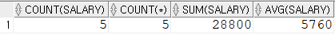
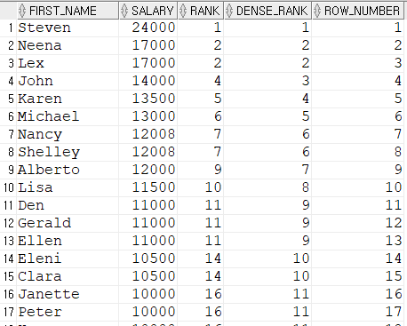

# GROUP BY, HAVING

```sql
SELECT 열1, 열2, ..., 열N
	FROM EMP
WHERE 조건식
GROUP BY RMFNQTLR
	HAVING 그룹조건식
ORDER BY 정렬식
```

### 집계 함수

- 여러 행을 바탕으로 하나의 결과 값을 도출해 내기 위해 사용하는 함수

```sql
/* 
- SUM : 지정한 데이터의 합  >  NULL데이터는 제외하고 합계를 구한다.
- COUNT : 지정한 데이터의 개수 반환
- MAX : 지정한 데이터 중 최댓값 반환
- MIN : 지정한 데이터 중 최솟값 반환
- AVG : 지정한 데이터의 평균값 반환
- STDDEV : 복수 행의 해당 컬럼 간의 표준편차
- VARIAN : 복수 행의 해당 컬럼 간의 분산
*/

SELECT COUNT(SALARY),COUNT(*), SUM(SALARY), AVG(SALARY)
FROM EMPLOYEES
WHERE JOB_ID = 'IT_PROG';
```



<br>

### GROUP BY절 : 결과 값을 원하는 열로 묶어 출력

```sql
SELECT DEPARTMENT_ID
FROM EMPLOYEES
GROUP BY DEPARTMENT_ID --그룸으로 묶는다.
ORDER BY DEPARTMENT_ID ASC
```

그룹으로 묶어서 통계낼 수 있다.

```sql
SELECT JOB_ID, COUNT(*), SUM(SALARY), AVG(SALARY)
FROM EMPLOYEES
GROUP BY JOB_ID;
```
그룹화된 열 외에 일반 열은 SELECT절에 명시할 수 없다.

<br>

### HAVING절 : GROUP BY절에 조건을 줄 때 사용

```sql
SELECT JOB_ID, SUM(SALARY)
FROM EMPLOYEES
GROUP BY JOB_ID
HAVING SUM(SALARY)>= 100000 ;
--단독 사용 불가, GROUP BY와 함께 사용
```

WHERE절은 출력 대상 행을 제한하고, HAVING절은 그룹화된 대상을 출력에서 제한한다.

<br><br>

### OVER()함수

- SELECT절에서만 사용 가능
- 목적 : 그룹화된 열 외에 일반 열은 SELECT절에 명시할 수 없는 **GROUP BY를 보완**

```sql
/*에러*/
SELECT DEPARTMENT_ID, COUNT(*) --함께 명시 불가
FROM EMPLOYEES; 
```

<br>

```sql
-- COUNT(*)OVER( ) : 전체 행수를 반환

/*전체 행의 수를 알 수 있다.*/
SELECT DEPARTMENT_ID, COUNT(*)OVER()
FROM EMPLOYEES;

/*DEPARTMENT_ID가진 행의 수를 알 수 있다.*/
SELECT DEPARTMENT_ID, COUNT(DEPARTMENT_ID)OVER()
FROM EMPLOYEES;

/*DEPARTMENT_ID의 수를 알 수 있다.*/
SELECT DEPARTMENT_ID, COUNT(DISTINCT DEPARTMENT_ID)OVER()
FROM EMPLOYEES;

/*GROUP BY와 달리 SELECT문에 컬럼을 추가할 수 있다.*/
SELECT FIRST_NAME, DEPARTMENT_ID, COUNT(DISTINCT DEPARTMENT_ID)OVER()
FROM EMPLOYEES;
```

<br>

### PARTITION BY

GROUP BY와 동일하지만, SELECT절의 칼럼에 영향을 주지 않음.

```sql
-- COUNT(*)OVER(PARTITION BY 컬럼) : 컬럼을 그룹으로 나누어 ROW의 수를 반환

SELECT DEPARTMENT_ID, COUNT(*)OVER(PARTITION BY DEPARTMENT_ID)
FROM EMPLOYEES;

SELECT department_id, first_name, salary,
    COUNT(*)OVER(PARTITION BY department_id)
FROM employees
```
**[요약]**

COUNT(*)OVER( ) : 전체 행수를 반환

COUNT(*)OVER(PARTITION BY 컬럼) : 컬럼을 그룹으로 나누어 ROW의 수를 반환

<br>

### 순위 함수

RANK( ) : 중복 순위 개수만큼 다음 순위 값을 증가 시킴

DENSE_RANK( ) : 중복 순위가 존재해도 순차적으로 다음 순위 값을 표시함

ROW_NUMBER( 

```sql
--RANK단독으로 사용이 불가 함 > OVER함수와 함께 사용
SELECT FIRST_NAME, SALARY, 
    RANK()OVER(ORDER BY SALARY DESC) AS RANK,
    DENSE_RANK()OVER(ORDER BY SALARY DESC) AS DENSE_RANK,
    ROW_NUMBER() OVER(ORDER BY SALARY DESC) AS ROW_NUMBER
FROM EMPLOYEES;
```



<br>

**ROWNUM 키워드  : 조회 순번 매기는 방법**

```sql
SELECT ROWNUM, EMPLOYEE_ID, FIRST_NAME 
FROM EMPLOYEES
WHERE ROWNUM <10 ; --ROWNUM열에 1부터 10까지 차례로 순번을 매김
```

cf) ROWNUM을 10에서 20사이의 값을 보고 싶다면?

```sql
SELECT ROWNUM, EMPLOYEE_ID, FIRST_NAME --WHERE절 이후에 수행 됨.
FROM EMPLOYEES
WHERE ROWNUM >10 AND ROWNUM =<20 ;  --먼저 수행됨
```

위와 같은 방법으로는 값이 나오지 않음! 아래와 같이 진행되어야 한다.

1. DATA 설정 (EX, 급여의 순위를 매긴다. 정렬)

    ```sql
    SELECT EMPLOYEE_ID, FIRST_NAME, SALARY
    FROM EMPLOYEES
    ORDER BY SALARY DESC;
    ```

2. ROWNUM 설정

    ```sql
    /*역순으로 정렬한 월급에 번호를 매긴다.*/
    SELECT ROWNUM AS RNUM, EMPLOYEE_ID, FIRST_NAME, SALARY
          FROM (SELECT EMPLOYEE_ID, FIRST_NAME, SALARY
                FROM EMPLOYEES
                ORDER BY SALARY DESC);
    ```

3. 범위를 설정

    ```sql
    SELECT RNUM, EMPLOYEE_ID, FIRST_NAME, SALARY
    FROM (SELECT ROWNUM AS RNUM, EMPLOYEE_ID, FIRST_NAME, SALARY
          FROM (SELECT EMPLOYEE_ID, FIRST_NAME, SALARY
                FROM EMPLOYEES
                ORDER BY SALARY DESC)
         )
    WHERE RNUM > 10 AND RNUM <=20;   --범위를 설정한다.
    ```


<br>

### select절 정리
```
SELECT 절
    SELECT 컬럼, 표준함수, 그룹함수, SUB QUERY, OVER() PARTITION BY
    FROM 테이블, SUB QUERY
    [ WHERE ] 조건 IN AND ANY ALL LIKE < > <> <= >= != = SUB QUERY
    [ GROUP BY ] 컬럼
    [ HAVING ] GROUP BY 조건
    [ ORDER BY ] 컬럼 ASC, DESC
    [ START BY ] 계층형
    [ CONNECT BY ] 연결형 PRIOR(상향, 하향)

JOIN
    INNER,
    FULL OUTER 
    CROSS
    OUTER(LEFT, RIGHT) 
    SELF
```