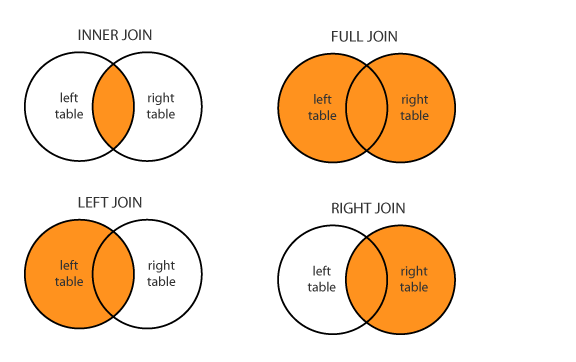
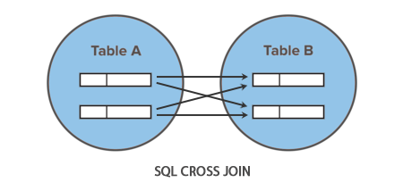

# JOIN


- 두 개 이상의 테이블을 연결하여 하나의 테이블처럼 출력할 때 사용
- 두 개 이상의 행(ROW)들의 공통된 값 PRIMARY KEY(기본키, PK), FOREIGN KEY(외래키) 값을 사용하여 조인한다.



[이미지 출처](https://fatihsoysal.com/blog/sql-join-mantigini-kavramak/)

**집합 연산자와 조인**
집합 연산자를 사용한 결과는 두 개 이상 SELECT문의 결과 값을 세로로 연결한 것이고,
조인을 사용한 결과는 두 개 이상의 테이블 데이터를 가로로 연결한 것이다.

- `테이블 이름.열 이름` >>특정 열이 어느 테이블에 속한 열인지 확인하는 방법
- FORM절의 테이블은 별칭을 지정할 수 있다. `FROM 테이블 이름1 별칭1. 테이블이름2 별칭2`

실무에서 SQL문을 사용할 때는 다소 번거롭더라도 테이블끼리 겹치지 않는 열 이름이라도 대부분 테이블이나 별칭을 명시한다. 조인 테이블 개수가 열 개를 넘기도 하고 각 테이블별 열 개수가 몇 십 개를 넘는 경우도 흔하기 때문

### INNER JOIN

특정 열 값이 일치한 출력 결과를 사용하는 방식

- ANSI SQL(표준)

    ```sql
    SELECT e.EMPLOYEE_ID, e.FIRST_NAME, e.DEPARTMENT_ID, d.DEPARTMENT_ID, d.DEPARTMENT_name
    --DEPARTMENT_ID는 두 테이블에 모두 존재하는 열이므로 어느 테이블에 속해 있는 열인지 반드시 명시해야 한다.
    FROM EMPLOYEES e INNER JOIN DEPARTMENTS d
        ON e.DEPARTMENT_ID = d.DEPARTMENT_ID;
    ```

- Oracle SQL

    ```sql
    SELECT EMPLOYEE_ID, FIRST_NAME, e.DEPARTMENT_ID, d.DEPARTMENT_ID,DEPARTMENT_name, LOCATION_ID
    FROM EMPLOYEES e, DEPARTMENTS d
    WHERE e.DEPARTMENT_ID = d.DEPARTMENT_ID;
       -- AND FIRST_NAME = 'Adam'; << 이렇게 추가로 조건식을 넣을 수 있다.
    ```

### SELF JOIN

동일한 테이블을 JOIN

하나의 테이블을 여러 개의 테이블처럼 활용하여 조인하는 방식

FROM절에 같은 테이블을 여러 번 명시하되 테이블의 별칭만 다르게 지정한다.

두 개의 열 중 일치한 데이터를 기준으로 조인되었으므로 큰 범위에서는 **등가 조인**으로 본다.

```sql
-- MANAGER_ID : 직속 상관의 사원 번호가 저장되어 있음

SELECT a.EMPLOYEE_ID, a.FIRST_NAME, a.MANAGER_ID, b.EMPLOYEE_ID, b.FIRST_NAME
FROM  EMPLOYEES a, EMPLOYEES b  -- a : 사원, b: 상사
WHERE a.MANAGER_ID = b.EMPLOYEE_ID;
--MANAGER_ID가 NULL인 열은 제외된다.
```

- 계층형 구조 오름(상향식)

    ```sql
    SELECT a.EMPLOYEE_ID, a.FIRST_NAME AS 사원, a.MANAGER_ID AS "사원의 상사 번호", b.EMPLOYEE_ID, b.FIRST_name AS 상사
    FROM  EMPLOYEES a, EMPLOYEES b  -- a : 사원, b: 상사
    WHERE a.MANAGER_ID = b.EMPLOYEE_ID(+)
    CONNECT BY PRIOR a.MANAGER_ID = a.EMPLOYEE_ID; --상향식 : PRIOR위치로 파악
    ```

- 계층형 구조 내림(하향식)

    ```sql
    SELECT a.EMPLOYEE_ID, a.FIRST_NAME AS 사원, a.MANAGER_ID AS "사원의 상사 번호", b.EMPLOYEE_ID, b.FIRST_name AS 상사
    FROM  EMPLOYEES a, EMPLOYEES b  -- a : 사원, b: 상사
    WHERE a.MANAGER_ID = b.EMPLOYEE_ID(+)
    CONNECT BY a.MANAGER_ID = a.EMPLOYEE_ID; --하향식 : PRIOR위치로 파악
    ```

외부조인(OUTER JOIN) 

- 조인 기준의 NULL을 처리하는 것을 목적으로 자주 사용하는 조인 방식
- 두 테이블간 조인 수행에서 조인 기준 열의 어느 한쪽이 NULL이어도 강제로 출력하는 방식


### LEFT OUTER JOIN

왼쪽 열을 기준으로 오른쪽 열의 데이터 존재 여부에 상관없이 출력하라

- ANSI SQL(표준)

    ```sql
    SELECT e.EMPLOYEE_ID, e.FIRST_NAME, e.DEPARTMENT_ID, d.DEPARTMENT_ID, d.DEPARTMENT_name
    FROM EMPLOYEES e LEFT OUTER JOIN DEPARTMENTS d
        ON e.DEPARTMENT_ID = d.DEPARTMENT_ID;
    ```

- Oracle SQL

    ```sql
    --2) Oracle SQL
    SELECT e.EMPLOYEE_ID, e.FIRST_NAME, e.DEPARTMENT_ID, d.DEPARTMENT_ID, d.DEPARTMENT_name
    FROM EMPLOYEES e, DEPARTMENTS d
    WHERE e.DEPARTMENT_ID = d.DEPARTMENT_ID(+); --(+)를 붙여준다
    ```

### RIGHT OUTER JOIN

오른쪽 열을 기준으로 왼쪽 열 데이터의 존재와 상관없이 데이터를 출력

- ANSI SQL(표준)

    ```sql
    SELECT e.EMPLOYEE_ID, e.FIRST_NAME, e.DEPARTMENT_ID, d.DEPARTMENT_ID, d.DEPARTMENT_name
    FROM EMPLOYEES e RIGHT OUTER JOIN DEPARTMENTS d
        ON e.DEPARTMENT_ID = d.DEPARTMENT_ID;
    ```

- Oracle SQL

    ```sql
    --2) Oracle SQL
    SELECT e.EMPLOYEE_ID, e.FIRST_NAME, e.DEPARTMENT_ID, d.DEPARTMENT_ID, d.DEPARTMENT_name
    FROM EMPLOYEES e, DEPARTMENTS d
    WHERE e.DEPARTMENT_ID(+) = d.DEPARTMENT_ID; --(+)를 붙여준다.
    ```

### FULL OUTER JOIN

- ANSI SQL(표준)

    ```sql
    SELECT e.employee_id, e.first_name,
        e.department_id, d.department_id,
        d.department_name
    FROM employees e FULL OUTER JOIN departments d
        ON e.department_id = d.department_id;
    ```

- Oracle SQL

    ```sql
    UNION 집합 연산자 사용
    ```

### CROSS JOIN



[이미지 출처](https://www.tutorialrepublic.com/sql-tutorial/sql-cross-join-operation.php)

- ANSI SQL(표준)

    ```sql
    SELECT e.EMPLOYEE_ID, e.FIRST_NAME, e.DEPARTMENT_ID, 
    			d.DEPARTMENT_ID, d.DEPARTMENT_name
    FROM EMPLOYEES e CROSS JOIN DEPARTMENTS d;
    ```

- Oracle SQL

    ```sql
    SELECT e.EMPLOYEE_ID, e.FIRST_NAME, e.DEPARTMENT_ID, 
    			d.DEPARTMENT_ID, d.DEPARTMENT_name
    FROM EMPLOYEES e, DEPARTMENTS d;
    ```

급여 범위를 지정하는 조건식으로 조인하기

```sql
SELECT *
FROM EMP E, SALGRADE S
WHERE E.SAL BETWEEN S.LOSAL AND S.HISAL;
```